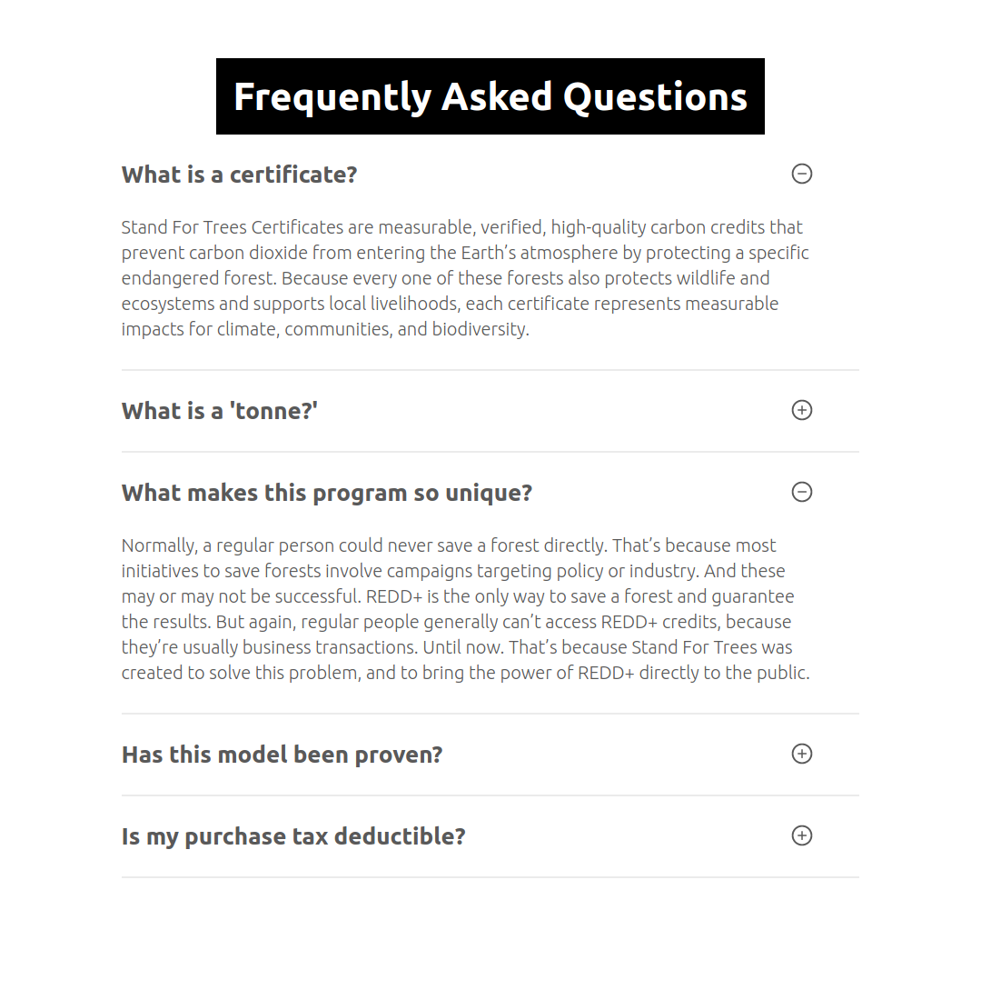

# nextjs-faq-page

Test project made with nextjs and strapi

# To run

```bash
cd backend
yarn develop
cd ../frontend
yarn dev
```

By default no FAQ Items will appear in the list since the database information is not commited to the repo. You'll have to add your own FAQ items if you want to see them appear on the webpage.

# Screenshots




# Things to Improve

- Load API key for environment variable or file, not have it hardcoded.
- Use an NGINX instance so that the compiled frontend code and the strapi backend API can be accessed through the same endpoint/port
- Make it so the FAQ items slide out when toggled instead of just appearing
- add i18n
